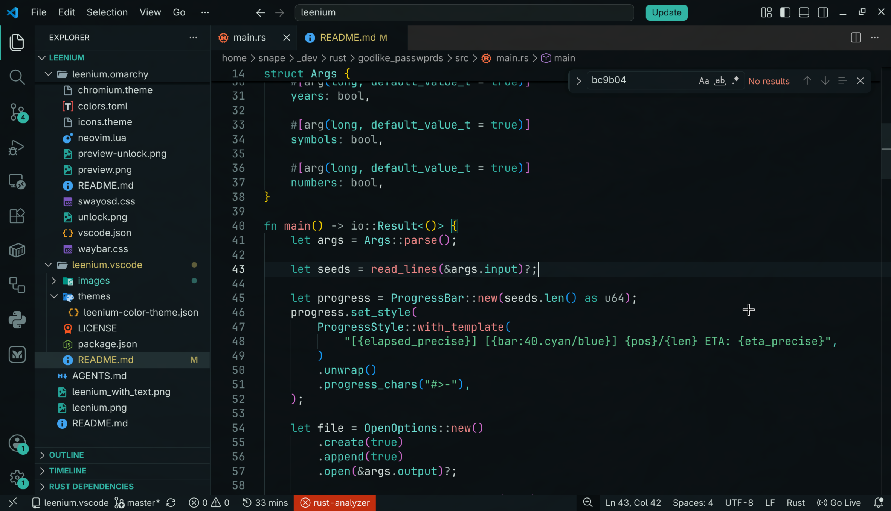
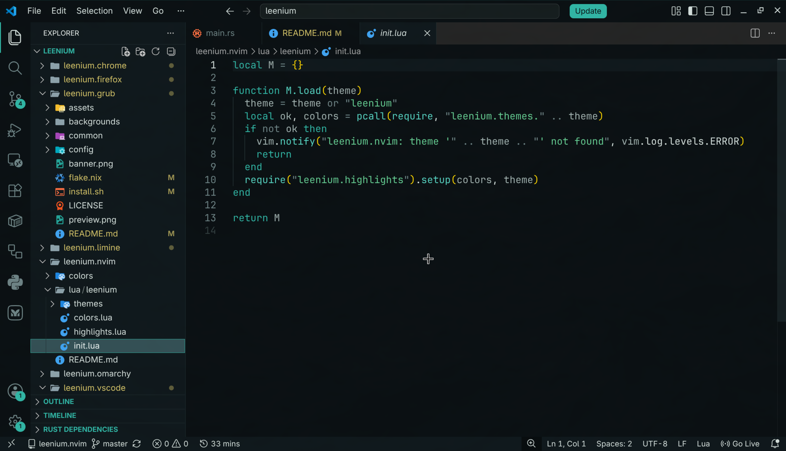

<div align="center">

# Leenium Theme 

 

**A deep, shared-palette dark theme for VS Code — part of the Leenium desktop ecosystem.**

Hosted under `github.com/drunkleen/leenium.vscode`.




[](https://marketplace.visualstudio.com/items?itemName=leenium.leenium-theme)
[](https://marketplace.visualstudio.com/items?itemName=leenium.leenium-theme)
[](LICENSE)

</div>

---

## Color Palette

| Role | Hex | Swatch |
|---|---|---|
| Background | `#0b1113` |  |
| Surface | `#11191c` |  |
| Selection | `#365156` |  |
| Foreground | `#d8e3e0` |  |
| Muted | `#718688` |  |
| Accent | `#33b8a8` |  |
| Cyan | `#59d6c5` |  |
| Emerald | `#4dba7a` |  |
| Blue | `#5e9bff` |  |
| Yellow | `#d9c76b` |  |
| Orange | `#f4a259` |  |
| Red | `#e16f73` |  |

---

## Features

- **Near-black canvas** — `#0b1113` background reduces eye strain during long sessions
- **Shared palette** — teal, cyan, blue, yellow, orange, and red are used consistently across UI and syntax
- **Cohesive UI** — activity bar, status bar, tabs, panels, explorer, and terminal all themed consistently
- **Semantic token support** — classes, functions, types, keywords, strings, numbers, and operators are styled
- **Explorer coverage** — git decorations, list states, tree guides, and filter widgets are themed too
- **Part of Leenium** — matches the full Leenium desktop stack (Waybar, btop, Neovim, Chromium, and more)

---

## Installation

**From the Marketplace:**

1. Open VS Code
2. Press `Ctrl+P` and run:
   ```
   ext install leenium.leenium-theme
   ```
3. Open the Command Palette (`Ctrl+Shift+P`) → **Preferences: Color Theme** → select **Leenium**

**From VSIX:**

```bash
code --install-extension leenium-theme-*.vsix
```

---

## The Leenium Ecosystem

Leenium is a unified dark desktop environment built around the same color palette. Alongside this VS Code theme, the project ships matching configs for:

- **Neovim** — syntax highlights and UI elements
- **Waybar** — status bar for Wayland compositors
- **btop** — resource monitor
- **Chromium** — browser theme
- **Firefox** — browser theme
- **SwayOSD** — on-screen display overlays

Visit [github.com/drunkleen](https://github.com/drunkleen) to explore the full setup.

---

## License

MIT © [Leenium](LICENSE)
