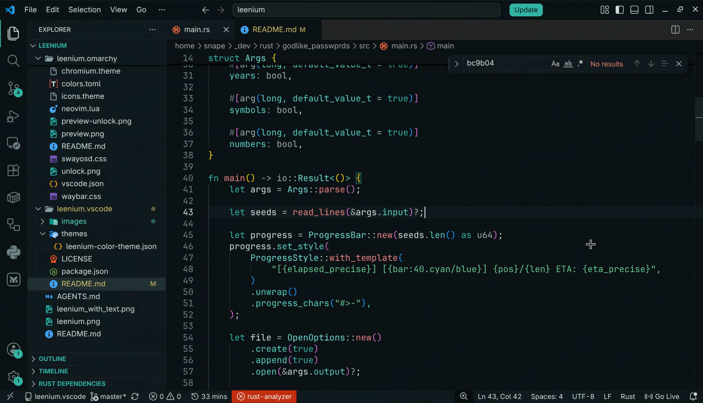
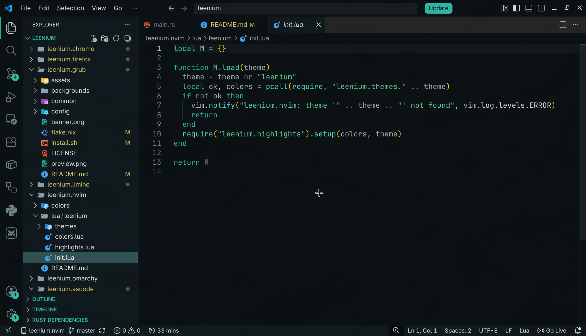

<div align="center">


**A dark VS Code theme built from the shared Leenium palette.**

Hosted under `github.com/drunkleen/leenium.vscode`.

[](https://marketplace.visualstudio.com/items?itemName=drunkleen.leenium-theme)
[](https://marketplace.visualstudio.com/items?itemName=drunkleen.leenium-theme)
[](LICENSE)




</div>

---

## Features

- **Near-black canvas** - `#0b1113` background reduces eye strain during long sessions
- **Shared palette** - teal, cyan, blue, yellow, orange, and red are used consistently across UI and syntax
- **Cohesive UI** - activity bar, status bar, tabs, panels, explorer, and terminal all themed consistently
- **Semantic token support** - classes, functions, types, keywords, strings, numbers, and operators are styled
- **Explorer coverage** - git decorations, list states, tree guides, and filter widgets are themed too
- **Part of Leenium** - matches the full Leenium desktop stack

---

## Color Palette

| Role | Hex | Swatch |
|---|---|---|
| Background | `#0b1113` |  |
| Panel | `#11191c` |  |
| Popup | `#182326` |  |
| Line / Border | `#223033` |  |
| Active | `#304144` |  |
| Selection | `#365156` |  |
| Foreground | `#d8e3e0` |  |
| Muted | `#718688` |  |
| Accent (Teal) | `#33b8a8` |  |
| Cyan | `#59d6c5` |  |
| Emerald | `#4dba7a` |  |
| Sea Bright | `#67cf94` |  |
| Type | `#71e4d8` |  |
| Warn | `#d9c76b` |  |
| Warn Bright | `#efd45e` |  |
| Orange | `#f4a259` |  |
| Error | `#e16f73` |  |
| Error Soft | `#f08787` |  |
| Blue | `#5e9bff` |  |
| Void | `#020405` |  |
| Sidebar | `#0e1518` |  |
| Card | `#141e21` |  |
| Floating | `#1d2a2d` |  |

---

## Install

**From the Marketplace:**

1. Open VS Code
2. Press `Ctrl+P` and run:
   ```
   ext install drunkleen.leenium-theme
   ```
3. Open the Command Palette (`Ctrl+Shift+P`) → **Preferences: Color Theme** → select **Leenium**

**From VSIX:**

```bash
code --install-extension leenium-theme-*.vsix
```

---

## The Leenium Ecosystem

Leenium is a unified dark desktop environment built around the shared palette. Explore the full ecosystem at [leenium.drunkleen.com](https://leenium.drunkleen.com).


<p align="center">
    Copyright &copy; 2026-present <a href="https://github.com/drunkleen" target="_blank">LEENIUM</a>
</p>
<p align="center">
    <a href="https://github.com/drunkleen/leenium.webpage/blob/master/LICENSE">
        
    </a>
</p>